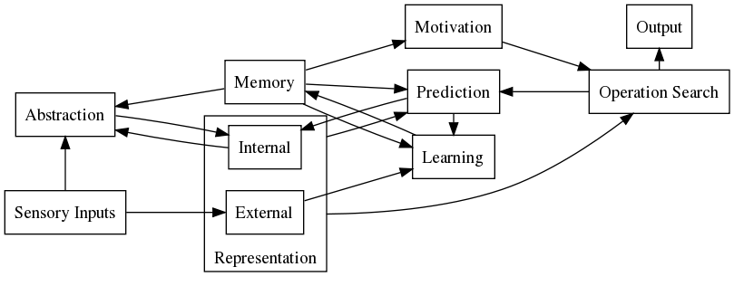

I believe that there is no easy answer to this question. Rather I suppose that
intelligent behavior emerges from many simple, modular processes.

I just wrote my current model of intelligence down. "current", because I evolve
it continuously and adept it to newly gained knowledge. Even if I have some
basic knowledge of artificial intelligence; I may not have the deepest knowledge
of theories of mind, yet. Therefore I do not claim that my model has to be
correct. However, it might be thought-provoking impulse. Particularly because
I try to show the totality instead of grabbing one exact area and saying that
this all what there is to intelligence.

<!--more-->

The picture gives a first overview over the elements which I think are crucial.
The connections show the collaboration between the elements and the information
flow. It might look a little bit chaotic, but as already said, I do not think
you can reduce intelligence to one simple formula.

In the following I will begin with the central part, the
**representation**. In my opinion some form of representation is
needed for intelligent behavior, because it is the only way one can try what the
result of some actions might be without doing this actions physically. I would
divide the representation into an **internal** and an
**external** representation. For example if you close the eyes you
will always have a vague idea where which objects were before you closed the
eyes. But in general you will not be able to remember all the details. With
closed eyes (excluding other senses) you can use only the internal
representation which is already highly abstract. This internal representation
will be supplemented with many details, which are the external representation,
if your eyes are opened.

This leads us directly to **sensory inputs**. These are all sensory
perceptions which the body perceives. Probably the external representation will
be build up by these. Because everything we sense is coded in neuronal signals,
the external representation is in fact also internal. But I call it external
representation, because without the information from the environment it cannot
reach it full detail level. The abstraction of these sensory inputs creates the
internal representation, which can persist without continuous input of senses
and may be manipulated in your mind to explore different possible actions.

Another important part of intelligence seems to be **abstraction**.
Not only the sensory perceptions will be abstracted, but also it is possible
that new abstraction are made based on the internal representation. Probably is
the memory important for this, because the skill to abstract makes uses of
experiences.

The **memory** means for me the totality of all information which
is stored for some time span. It makes learning and remembering possible.

Another important point is the **operation search**. This "module"
searches based on the current representation for different possibilities to act
and rates them. Afterwards it will causes a appropriate action to be executed.

These actions will be executed by the **output**. These are in
general all muscle movements: grasping something, going somewhere, speaking
something.

To make it possible to evaluate the consequences of operations or actions, some
form of **prediction** is needed. For such an operation the
internal representation will be changed to reflect the most probable
consequences based on the current representation and the memory of earlier
experiences. In this way it is possible to explore action possibilities. Of
course, the memory is very important here, because the prediction of action
consequences depends heavily on experiences.

By calculating the difference between such a prediction and the real changes in
the external representation it is possible to learn. Either by abstracting these
differences or may be also with some other method. It might be reasonable to
introduce an own module **learning** for this. Moreover, because
learning itself is a wide area in which research is done.

Least, but not last, we have the point **motivation**. Without the
motivation to achieve something no goal-oriented acting is possible in my
opinion. Therefore I believe this point to be very important.

This is my current thought model in a nutshell. I would appreciate critics,
additions and agreement in the comment. May be this article is also some food
for thought for one or another.

