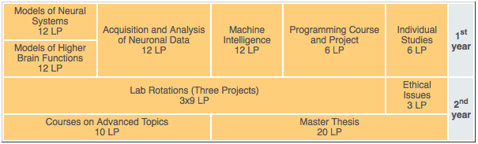

I am studying [the Master's degree Computational
Neuroscience](http://www.bccn-berlin.de/Graduate+Programs/Master+Program/) in
Berlin for a half year now. Previously, I was doing my Bachelor’s degree in
[Cognitive Computer
Science](http://www.zfl.uni-bielefeld.de/studium/bachelor/kognitive_informatik)
in Bielefeld and was writing each semester about [my experiences (in
German)](http://www.hyper-world.de/de/2009/02/18/kognitive-informatik/). [A post
about Cognitive science in another
blog](http://www.aiplayground.org/artikel/coxi/) inspired me to do so and I want
to keep up with the tradition. Thus, here is my report about the first semester
Computational Neuroscience! It is in English because the course of studies is
also and it aims on attracting foreign students.

<!--more-->

## Overview

<Toc />

## What is Computational Neuroscience? Should I study it?

First of all, you might ask what the heck is Computational Neuroscience? (I will
abbreviate it with CNS in the following.) I will try to give you some kind of
a definition, but don't be surprised if other people have other definitions.

Probably, the neuroscience part of CNS is rather clear. It is the science about
neurons and neuronal systems (most prominently the brain): How do neurons work?
What kinds of neurons exist? How do they connect? How is the nervous system
affected by diseases? These are some examples of questions asked by this branch
of research. The ultimate goal is of course to understand the brain in its
entirety.

The more mysterious part of CNS is the “computational”. It can be interpreted in
at least two different ways. On the one hand, it specifies what neuroscientfic
topic is examined: the way neurons do computations and process information. On
the other hand, it specifies the most important method used in this science:
computer simulations of neurons and networks of neurons.

This makes CNS a highly interdisciplinary enquiry. Methods and knowledge from
biology, medicine, psychology, mathematics, physics, computer science and maybe
even more fields have to be combined. I think, this makes it highly interesting,
but can also be daunting as you will certainly touch scientific fields in which
you are not overly comfortable.

Overall CNS is very theoretical: The modelling of neurons and networks is itself
theoretic because models are usually mathematical models. But also the analysis
of fMRI (functional magnetic resonance imaging, that is what produces these nice
pictures of brain activation) involves quite a lot of math. Therefore you should
be comfortable with math and computer science.

Nevertheless, don't be fooled into thinking there is not so much biology in
there. For me as computer scientist it's quite a lot. At least, our models
should be biological plausible and this requires us to know biology and also
physics (maybe even a bit chemistry).

Beneath bridging between different scientific fields an important aim of CNS is
to bridge scales. Neurobiology examines single neurons, psychology examines “the
behavior of whole brains”. But how do we cross the scales from single neurons to
whole brains? CNS has the potential to play in important role in answering that
question.

I hope this gave you some impression. If not, take a look at
[Wikipedia](http://en.wikipedia.org/wiki/Computational_neuroscience) or [the
website of our institute](http://www.bccn-berlin.de/Research/?languageId=1).

Now, that you know what CNS is you might wonder: “Should I study it?”

### You should study CNS if …

* you think, the traditional artificial intelligence stuff in computer science is biologically to implausible to ever get really intelligent.
* you want to understand how one gets from single neurons to the behavior of a complete brain.
* you want to do (academic) research. (The course of studies is heavily research oriented.)
* you like many natural sciences and math.
* you are looking for a challenging course of studies.
* you want to study in a small group with nice and international colleagues.

### You should **not** study CNS if …

* you do not like math.
* you cannot program or even worse cannot use a computer (although basic programming skills might suffice).
* you are not interested in neurobiology or basic psychology.
* you run away screaming when hearing electrical engineering terms like “capacitance”.
* you are too easily frustrated by exercise sheets you cannot solve within an instant.
* you want a well payed job (actually, I have no idea, how well payed jobs for CNS graduates are; but probably you could earn more money with a computer science degree in the economy).
* you are not able to learn missing background knowledge by yourself.
* you cannot speak and understand English (should be obvious ;)).

## Where do I study it?

Like me, you can study Computational Neuroscience as a Master's degree at the
[Bernstein Center for Computational Neuroscience in Berlin (BCCN
Berlin)](http://www.bccn-berlin.de/Home/?languageId=1). That is mainly an
association of different research groups of all major universities in Berlin.
Most prominently the [Technische
Universität](http://www.tu-berlin.de/menue/home/parameter/en/) (TU, “technical
university“),
[Humboldt-Universität](http://www.hu-berlin.de/?set_language=en&cl=en) (HU),
[Freie Universität](http://www.fu-berlin.de/en/index.html) (FU, “free
university“) and the [Charité](http://www.charite.de/en/charite/). In the
Master's degree you will be enrolled at the TU, but the degree will jointly be
awarded by the TU and HU. The BCCN offers also a PhD graduate program in the
area of Computational Neuroscience.

But there are also some alternatives of more or less similar Master programs in
the German speaking area (I cannot list every program in the whole world):

* [Neural Information Processing in Tübingen](http://www.neuroschool-tuebingen-comput.de/index.php?id=182) seems to be focused more on the biological foundations in comparison to Berlin. The program in Tübingen can be completed in 3 semesters (opposed to 4 in Berlin), but then you have probably not a single week of holidays. After completing the program you can directly continue with a PhD. Actually, they prefer students who also want to pursue a PhD afterwards. The Neural Information Processing program is also related to the [Bernstein Center for Computational Neuroscience in Tübingen](http://www.bccn-tuebingen.de/). If you are interested in Neurosciene, but not so much in Computational Neuroscience, Tübingen offers also [a couple of other Neuroscience programs](http://www.neuroschool-tuebingen.de/).
* [Neural Systems &amp; Computation in Zürich (Switzerland)](http://www.nsc.uzh.ch/). Can't say much about this except that the living expenses in Zürich probably exceed the ones in Berlin.
* [Science of Intelligence in Berlin](http://www.scienceofintelligence.de) is not a Master program on his own, but a specialization which can be studied as part of different Master programs. At the moment this is at least possible as part of the Computer Science program at the TU Berlin and maybe also as part of the Computer Science program of the FU Berlin. This already shows that this program is much more computer science and artificial intelligence oriented. Apart from that mainly psychology contributes to this program. Nevertheless, the program allows to visit most of the Computational Neuroscience lectures as far as I know. What I do not know is whether it is possible to only do English lectures in this program. At least the webpage seems to be German only.
* The [Computer Science Master program of the TU Berlin](http://www.studienberatung.tu-berlin.de/menue/studium/studiengaenge/faecher_master/informatik/) offers also the focus Intelligent Systems which is probably even more Computer Science/artificial intelligence. Again I cannot tell you whether you have to attend German lectures.
* In Bielefeld (were I obtained my Bachelor's degree) is another place offering [Intelligent Systems](http://www.techfak.uni-bielefeld.de/web/Studium/Studiengaenge/MasterISY). Unfortunately, only in German.

If you are not so much interested in theoretical aspects, there is quite
a number of other Neuroscience programs with a different focus. Just search for
them.

In the following I will only talk about the Computational Neuroscience program
here in Berlin because that is the program I am in.

## I have to get a Bachelor's degree first! In what should I do it?

Maybe you do not have started with a Bachelor's degree, yet, and are wondering
which one would be the best preparation for Computational Neuroscience. You
should chose a degree with a high amount of math and some programming. I think,
Computer Science is a good choice because those programs teach a mostly
sufficient amount of math and also you get the required programming skills.
Maybe you will learn even a bit physics or electrical engineering which is also
helpful. But you might lack some biological knowledge. Math, Physics and
Electrical Engineering are presumably also very good choices. However, then you
might not just lack the biological knowledge, but also the programming skills.
However, I suppose most Math programs also teach a sufficient amount of
programming by now. Biology might also look like a good choice in preparation
for CNS. It might teach you all the relevant neurobiology and neuroanatomy.
Nevertheless, you might lack the math and programming skills. I think, those
stuff is much harder to acquire on your own than the biological foundations.

Apart from these general considerations there are two programs I can especially
recommend. Probably the more well known is [Cognitive Science in
Osnabrück](http://cogsci.uni-osnabrueck.de/). I believe, it gives you a good
overall view of cognitive science and neuroscience. Also, as far as I know, it
gives you enough possibilities to focus on specific parts (math, computer
science, psychology, biology, ...). In my class are two people who did their
Bachelor degree in Cognitive Science and among all the people of the BCCN are
many more. There is also the [German article about the
program](http://www.aiplayground.org/artikel/coxi/) by a former Cognitive
Science student (I mentioned it already in the introduction).

Finally, one of the best preparations&nbsp;– in my opinion&nbsp;– is the program
I studied: [Kognitive Informatik in
Bielefeld](http://www.zfl.uni-bielefeld.de/studium/bachelor/kognitive_informatik)
(Cognitve Computer Science). It is mainly computer science and gives you
therefore nearly all of the relevant math knowledge and sufficient programming
skills. In the first semester you also have a course about basic neurobiology
covering some of the required biology knowledge. Moreover, there is the course
about neural networks and learning. This gives you an easy start in the Models
of Neural Systems lecture where you will discuss the perceptron and maybe
Hopfield networks first before continuing with more biological plausible models.
But more important many topics in the Machine Intelligence course will be
a repetition (more about that below). Depending on which elective courses you
chose you can get even more preparation for CNS. I suggest to take one
Statistics course as elective (e.g. “Teilmodul Statistik/Infomartik” of the
department of biology) to get the formal math requirements for the application
(even if this is a somewhat soft requirement). It is also quite helpful and with
all the math you will have had before not very difficult (but it is not
a repetition of content of other math courses). Unfortunately, the program is
only in German. If you want to know more about Kognitive Informatik, you can
read about it [in my German
blog](http://www.hyper-world.de/de/2009/02/18/kognitive-informatik/).

Whatever program you might chose for your Bachelor's degree you will probably
miss some knowledge. But this is normal for such an interdisciplinary program.
Actually, in the program is time devoted to individual studies to close those
gaps. Thus, do not be afraid of having some gaps, but be prepared to close them
by yourself.

## How do I get into the Computational Neuroscience program?

You have decided to study Computational Neuroscience and you are wondering how
to get into the program? You have to apply by March, the 15th, for the next
winter term. To do so you have to fulfill some prerequisites (no warranty for
correctness, also check [the official
sources](http://www.bccn-berlin.de/Graduate+Programs/Master+Program/Prerequisites/)):

* You will need a Bachelor's degree. Actually, you can apply without having the Bachelor degree completed because the application deadline is probably before you receive your degree if you want to pursue the Master directly following the Bachelor. In this case you have to provide your certificate within a certain time frame (I believe, you have time until end of the first semester to hand in all certificates) and the application has to contain some kind of preliminary certificate with the current grades.
* You have to be a native speaker of English or proof that you have a certain level of proficiency. There are different ways to do so. For example they accept the internet based TOEFL test with at least 88 points.
* You need “sufficient” (24 credit points) mathematical knowledge including linear algebra, analysis, probability theory and statistics. See the official pages for the details.

Then you will need some documents:

* A letter describing your motivation.
* A tabular CV.
* A transcript of records (and certificates) of previous studies.
* Two letters of recommendation.
* Certificates of the prerequisites mentioned above.
* A couple of filled out application forms (see [the official sources](http://www.bccn-berlin.de/Graduate+Programs/Master+Program/Application/)).

This is quite some stuff. Thus, better start early to get all of the documents
together and take a look at the formal requirements. There are quite specific
instructions how copies have to be certified. Once you have everything you apply
by using the online platform
[uni-assist](http://www.referat-1a.tu-berlin.de/menue/graduate_admissions/application/all_applications_for_master_courses/parameter/en/)
(you still have to mail the documents). The first reply that I have been
selected for the Master program came by email at the beginning of May.

Make sure you get all the formalities right because uni-assist does
a pre-selection based on these formalities and only those applications will be
forwarded to the BCCN selection committee. In case you notice that something
went wrong you should contact our [teaching coordinator Vanessa
Casagrande](http://www.bccn-berlin.de/Home/Contact). She might still be able to
retrieve your application from uni-assist and clarify any issues.

As far as I know there were about 70 applications this year (for the winter term
2012/2013) and each year 10 new students are allowed to join the program. If you
want more details on how the students are selected, you can [take a look at the
Admission
Regulations](http://www.bccn-berlin.de/Graduate+Programs/Master+Program/Administration/).
The most important single part is the grade of the Bachelor's degree, but the
mathematical courses and other qualifications are also quite important. This
allows to counterbalance shortcomings in one area with other achievements and
highlights the overall picture of the applicant. In the end each application is
ranked by a score and the highest ranked students get selected.

## CNS at the BCCN

The structure of the Computational Neuroscience program is as follows at the
Bernstein Center in Berlin:

In the first year you will have normal courses. In the second year you are
mainly doing project work in different research groups (“Lab Rotations”) and
writing your Master thesis. You can take a look at [the official module
page](http://www.bccn-berlin.de/Graduate+Programs/Courses+and+Modules/) to get
an impression of what the schedule in the first two semesters might look like.
Note that there might be listed a few lectures which are not compulsory. The
amount of time spent on exercises is of course not visible in the schedule and
that is quite a significant amount of time.

You might have noted that each module is given with a number of LP. This stands
for the German “Leistungspunkte” meaning credit points. Sometimes you will also
find the abbreviation ECTS for European Credit Transfer System. The credit
points are supposed to indicate the amount of work needed to complete the module
whereby one credit point is supposed to be 30 hours of work.

It is quite nice that you can select from a variety of courses from all major
Berlin Universities in the elective courses Individual Studies and Courses on
Advanced Topics. The former module will be discussed a bit more below. The
latter will (probably) discussed in a later blog post after I completed it. But
take a look at the section about the GRK Lecture where I am also telling a bit
about this module.

If you have study related questions, there are at least three persons you can go
to. One is mentor which gets assigned to you at the beginning of the Master
course. It is usually a professor at the BCCN, but can sometimes also be a PhD
student. The mentor is supposed to give you study related advice and discuss
what to do as Individual Studies. Depending on the person assigned to you this
can be more or less helpful. It really depends on how much the mentor wants to
do this. Some really like it, whereas others not even answer any of your emails.
But our teaching coordinators are trying to ensure an adequate mentoring by
exclude those persons. In any case, you are free to change your mentor anytime.

The other two helpful persons are our teaching coordinators Vanessa Casagrande
and Julia Schaeffer. If you have any questions or problems related to the study
program you can always go to Vanessa. Also, she is providing us with useful
information how to organize our courses, sometimes acts as bridge between the
lecturers or the examination office and us. Probably it also due to her
communication with the examination office that our courses from all the
different universities get recognized without problems. It seems that this is
usually really troublesome in other study programs.

To give you a better impression what we learn in the individual modules and
lectures I will discuss the modules I attended during the winter term in the
following. Apart from those there is nearly every week at least one
neuroscientific talk you can attend in Berlin.

### Math Prep Course

It all started with the Math Prep Course at the beginning of October. It is not
compulsory, but I would suggest visiting it. It gives you already 4 of the
6 credit points for the Individual Studies. Most of the math you will need
during the program (analysis, linear algebra, differential equations,
probability theory and some other stuff) will be discussed there. That way you
can close gaps in your math knowledge and reactivate your rusty math skills.

The lectures were held by Prof. Schimansky-Geier. His English is not the best
and his lectures are not very energetic, but all in all quite okay. The lectures
before noon were followed by a tutorial. We had two different tutors, but
I think I met only one (I missed out on some days of the course). Unfortunately,
that tutor's English skills were really bad leading to many misunderstandings.
Either she didn't understand our questions or we didn't understand her
explanations. :( As far as I know the next Math Prep Course will be held by
a new professor at the BCCN. So, things might improve.

About two weeks after the Math Prep Course of eight days we wrote an ungraded
exam. It wasn't very hard and as far as I know nobody in our year failed the
exam.

### Individual Studies

You have to earn 6 ungraded credit points in the module Individual Studies. It's
purpose is to give you the possibility to close gaps in your knowledge required
to study the program. Basically, you can take any course you want, but it should
be approved by your mentor. Many of us did the Math Prep Course because it is
before the regular semester. Therefore, it is not adding to your high workload
later. It already gives you two thirds of the points needed, too.

It is also possible to get credit points for reading a book or attending
a summer school. You should talk to your mentor if you want to do this. I have
read a couple of chapters in the [Principles of Neural Science by E.
Kandel](http://en.wikipedia.org/wiki/Principles_of_Neural_Science) but have
still to meet with my mentor to finally get the credit points.

### Programming Course and Project

The Programming Course is held by Robert Martin. It consists of lectures in
which you learn Python and some other things like SVN, Test Driven Development
or UML. If you never have done any programming before, it will probably be hard
to follow. In contrast it can be quite boring if you are already familiar with
programming.

Besides the lectures there is a tutorial and you have to do some exercises.
These are quite easy and do not add much to the overall workload. Do not expect
to get much feedback on them.

After the semester you have to do a two week programming project in a small
group (2 to 4 people). You can freely chose a project. It is quite common to
replicate the work of some neuroscientific modelling paper (in my group we
replicated [this paper](https://www.cs.utexas.edu/users/dana/nn.pdf)). In the
next winter semester we have to do a presentation of it to the new students to
give them an idea what they can do.

### Models of Neural Systems

The Models of Neural Systems course consisted out of four parts: a theoretical
lecture, an “experimental” lecture, a computer practical and an analytic
tutorial. The theoretical lecture was the main lecture. It covered topics like:

* Basic artificial networks including the perceptron and memory networks.
* Phenomenological model of single and complex cells in the visual cortex.
* Nernst equation for estimating reversal potentials.
* Goldman-Hodgkin-Katz current and voltage equations (also to estimate reversal potentials).
* Leaky integrate and fire neuron model.
* Hodgkin-Huxley model for action potential generation.
* Modelling stochastic ion channels.
* Phase space analysis of differential equations.
* Cable equation to model extended neurons.
* Networks of neurons modelled by differential equations.

As you can see the modelling of single neurons and their action potentials were
in the focus. Differential equations are quite important for this. The lecture
was mostly held by Prof. Kempter, but some parts like the cable equation were
done by Prof. Lindner. In my opinion both lectures are good average.

Every week we had to solve an analytical problem sheet and programming problem
sheet with exercises related to the lecture. The time needed for solving was
quite much (several hours). The programming exercises were done with a partner
and in the last five weeks we got a project instead of exercises. We also had to
do a short presentation about it. Officially this presentation does not
influence the grade, but someone saw the lecturer taking notes about the quality
of presentations. Decide for yourself what you think about *this*. ;)

The theoretical lecture was concluded by an oral exam of 30 minutes. This was
quite manageable. I heard from no one who got a grade worse than 2.0.
I personally got some nasty questions about a topic I overlooked a bit when
learning for the exam, but I was able to deduce the answers from other
knowledge. That way I also got a absolutely satisfying grade.

Until now I did not write anything about the experimental lecture. That's
because it is not directly related to the other parts. The experimental lecture
was held by another lecturer each week presenting their own research. It was
nice to get such a variety of impressions. The content of these lectures was not
relevant for the exam.

### Acquisition and Analysis of Neuronal Data

This module lasts two semesters and will end with an oral exam. Of course
I cannot tell you something about the second term, yet. The topics covered in
the first term  included cellular recordings (extracellular, patch clamp etc.),
EEG and fMRI. Thus, it was more acquisition than analysis and the next semester
it will be the other way around.

The lecturers were Prof. Brecht, Prof. Curio and Dr. Blankenburg. Depending on
the person the lectures were average to excellent. You have to get a bit used to
Prof. Brecht's lecturing style. He will usually ask a couple of questions during
the lecture and wants you to make guesses if you do not know the answer. At
least this makes it a bit more interactive and lets you think about material.

Besides the lectures we saw demonstrations of the cellular recording techniques
in anaesthetised rats. This was quite interesting once you got used to the
preparation of the animals. If you do not want to attend these animal
experiments for whatever reason, probably no one will force you. But it is good
to see for yourself how such experiments are performed. Moreover, much more
measures to prevent any pain or discomfort to the animal were applied than
I imagined.

### Machine Intelligence

Another module lasting two semesters is Machine Intelligence. In the winter term
we focused on supervised machine learning techniques, whereas we will focus on
unsupervised learning in the summer term. More precisely, the topics of the
first half were:

* Artifical Neural Networks
  * Multilayer Perceptron
  * Radial Basis Function Networks
* Statistical Learning Theory
* Support Vector Machines
* Probabilistic Methods
  * Bayesian Networks
  * Bayesian Inference

The importance of Machine Intelligence for Computational Neuroscience is
twofold. On the one hand, it provides a theoretical background and the
artificial intelligence view on learning (and similar topics). On the other
hand, the methods of Machine Intelligence are often used for data analysis in
neurosciences.

The lecturer of this course was Prof. Obermayer. He structured the topics in
a very good way in my opinion (better than in a similar lecture I heard in
Bielefeld). Unfortunately, his presentation is very “dry” and I am missing good
examples or demos of the learning algorithms (this was definitely better in
Bielefeld).

Each week an exercise sheet has to be solved and will be discussed in
a tutorial. Usually these are analytical exercises, but sometimes also
programming exercises. The programming exercises have to be solved in small
groups. After the second part of the lecturer we have to take an oral exam
covering both parts.

### GRK Lecture Series

Every first and third Wednesday of a month the three hour GRK Lecture takes
place. It is held each time by a different lecturer giving an introduction to
things related to their research. Therefore there is quite a variety of topics
which are varyingly interesting. Nevertheless, it is nice to get an introduction
to such a variety of topics. Take a look at the [official
webpage](http://www.bccn-berlin.de/Graduate+Programs/Courses+and+Modules/GRK_Lecture_Series/)
to get an impression of the topics.

The GRK Lecture Series is mandatory for PhD students, but can also be taken by
Master students. It can than be part of the Courses on Advanced topics and gives
6 credit points for two semesters. You can chose between ungraded or graded.
Each way you have to solve some exercise sheet for each lecture and your grade
will be calculated from your scores on those sheets. The problem with this is
that you are almost never sure what exactly is expected of you in the exercises.
Usually you know this after one or two exercise sheets because in most courses
all sheets are rated by one person. But in the GRK lecture it is each time
someone else.

If you intend to take this course, anticipate the additional workload. But you
can manage it. I think, approximately half of our class is doing this lecture
additionally and is able to cope with it. Also, it is nice to get already 6 of
the 10 credit points for the Courses on Advanced topics in the first year.
Another thing to keep in mind is that there are some lectures during the
semester break (as the PhD students do not have semesters and semester breaks).

### Ethical Issues

The module on Ethical Issues is a one week block course which is intended to be
taken after the third term. However, some of this year's Master students
including me decided to do it already after the first semester. Actually,
I would recommend it doing this way. It does not add to the workload during the
semester and gives you more flexibility when you are doing you lab rotations.
This could be especially important if you are planning to do a lab rotation
abroad. Moreover, there were some things which you ideally should have heard or
thought about *before* the lab rotations.

This year the module was for the first time the “Winter School Ethics and
Neuroscience” and open for external students (not just of the Berlin
universities). It consisted mainly of different lectures. The topics included:

* The Neurobiology of Values – Scientific Paradigms
* Introduction to Applied Ethics
* Good Scientific Practice
* Patient Data Security
* Deep Brain Stimulation and Ethics
* Ethical Issues of Animal Experiments
* Neuroenhancement
* Legal Aspects of Neuroimaging
* Social and Ethical Implications of Brain-Hardware Interfaces
* Ethic Committees

Depending on the lecturer the parts were more or less interesting to listen to.
I found the style of presenting of two lecturers quite bad, but other lecturers
were excellent (e.g. the Introduction to Applied Ethics by Prof. Pauen or Good
Scientific Practice by Prof. Dirnagl). In fact, this ethics course was the
module I liked most so far.

Apart from the lectures we had to do some group work and present it.
Unfortunately, they assigned the groups at random by counting and you had only
a vague idea who was part of your group. This made it hard to organize the group
work.

## Social Life

Maybe you are not just wondering what you will learn in the Computational
Neuroscience program, but also about the kind of people studying it. With just
10 people each year it seems that you do not have many possibilities to chose
your friends and to some degree this might be true. However, I can say only good
things about the students from my year and those of previous years. The class of
my year is meeting nearly every weekend for some fun activity. I heard similar
things from previous years.

Also, there is not much competition among us students as one might expect.
Rather, we help each other if someone has a question about an exercise or
similar stuff. As discussed before in some exercises we are even “forced” to
work together.

Apart from the students of your year you can meet other people (mostly older
students and PhD students) at various occasions. Once a month the “BCCN
Stammtisch” takes place where we meet in a bar, in December was a Christmas
party, in the summer there might be barbecues and there is the BCCN retreat. The
nice thing about these events is that you can easily meet the older students and
PhD students. They can give you valuable information about their exams and lab
rotations. Or you have just fun partying together with them. :)

If you want to get to know even more people, you could try the sports courses of
one of the universities. They offer a large number to chose from.

Another thing I should mention, even though it has not necessarily to do with
the social life, is that I am quite impressed by the connections between
research groups. I was surprised quite a number of times that one person knows
or works together with another person from a completely different research
group. I think, such close networks exist not everywhere and being part of such
a network is a really good thing.

## Where to Live

Most courses take place at the BCCN which is located at the HU Nord campus. That
again is located near the Charité Mitte (which in turn is near to the central
station). However, one day in the week you will have courses at the TU campus
which is at the west side of Tiergarten. This makes the district called Moabit
quite popular among CNS students because it is more or less in-between both
locations ensuring short routes and it is also quite central. Me included three
persons of our year are living there and at least two PhDs, too.

I think, the rents in Moabit are low priced. But they can vary at least by
a factor of two (a colleague is paying about the same as I for half the space).
I am not sure whether it is the reason for the affordable rents or the other way
around: Quite many immigrants and unemployed live Moabit. Moreover, [the
official website of
Berlin](http://www.berlin.de/special/immobilien-und-wohnen/stadtteile/901338-768874-moabit.html)
says that the criminality is high. But so far personally I felt save in Moabit
and in my opinion the district Wedding is worse. I visited some flats there and
did not like the area there too much.

Another area is currently becoming popular among the students in our year: Three
have moved near to Rosenthaler Platz in Berlin Mitte. It is a nice area near to
the BCCN, but not as near to the TU.

Unfortunately, I am not able to say something about all the other districts
except one thing you should keep in mind: Berlin is a large city and I would not
suggest to take a flat to far away from the BCCN. Then it can easily take you an
hour each to get to the university and that is really a lot of wasted time. You
might need that time in the first (maybe also second term to do the exercise
sheets if you still want to have some leisure time.

## Where to Eat

Both near the HU Nord campus and the TU campus is a canteen (called “Mensa” in
German) where you can get a meal for usually 2 to 3 euros (or a bit more for
special meals and extras) as student. Even though the food there is not really
bad, it is not very special and you can get sometimes the feeling that every
dish tastes the same. In case you get bored by the food there, you should try
[Thai Tasty](http://www.thai-tasty.de) and an Oriental place in Luisenstraße.
That is very close to the HU Nord campus and BCCN and you get there a good meal
for about 5 euros.

Of course there is an enormous number of restaurants in Berlin with quite
a number of good ones. Some of these are even quite cheap. One place you should
definitely try is [Dolores](http://www.dolores-online.de/) where you get really
good burritos!

## Where to Work if You Need Money

In case you need money, you can try to get a job as student assistant in one of
the research groups. I regularly get mails about open positions on the mailing
lists and it seems to me that you will always find a position if you want to.
Usually you will work 40 hours a month and get paid with approximately 10 euros
per hour.

Despite that, keep in mind that the CNS master program is intended to be a full
time study program and it is indeed a lot of work. I was able to manage 40 hours
a month in the first semester. But most of the time I had the feeling that the
workload was too much. Therefore, I reduced the work time to a maximum of 30
hours by now. So far I'm quite happy with it this term.

If you apply for job, you should check where your workplace is. Spending each
time one unpaid hour to get there or to get back might not be what you want to
do. My workplace is at in the Charité Mitte next to the BCCN/HU Nord campus.
That is very comfortable because I can walk over there in five minutes and use
the free time between courses to work.

## My Personal Experience and Conclusion

This whole article has been influenced by my views for sure and at some points
I already mentioned some personal experiences. Nevertheless, I want to conclude
with some more details on how I personally experienced the first term.

To be honest: I was a bit disappointed in several ways, yet I really like the
program. Before I started I imagined the lectures to be really great in such
a small and prestigious Master program. In fact, they were mostly good with some
not so good and some excellent lectures in-between. Thinking about this it is
clear that there is no real reason why the lectures in the program have to be
better or worse than elsewhere. The lecturers got their professorship for
scientific achievements and there is obviously no reason why this should
correlate with giving especially good lectures. Anyways, the small lectures can
be an advantage because the lecturers can really discuss questions. I also
liked, that one lecture is not necessarily given by only one lecturer, but that
each part is done by a lecturer who is focused with his research on that
specific topic.

One of the reasons for me starting this Master was that I was missing the
biological foundations and plausibility in pure computer science and artificial
intelligence. Strangely, it turned out that I got the feeling of CNS being too
much biology and too less computer science for me. But the biology stuff got
more interesting over time as I got more familiar with it. Nonetheless, I am
pretty sure that I do not want to do single cell modelling, but more higher
level stuff (which will be covered in the second term).

And last but not least, it was just too much work in the first term. In my
Bachelor's degree I was able to do several courses more than the standard
curriculum proposed and to work in parallel. Because the amount of credit points
in the curriculum per semester was the same in my Bachelor's degree as in the
CNS program I expected the workload to be roughly the same. Unfortunately I was
mistaken. Due to the workload I was quite unhappy and stressed out the last
semester and this caused myself believing that I made the wrong choice with the
master. So far the second term is much better. Reducing working hours was a good
choice and I have the impression that I am spending a little less time on
exercises. By the way, I think the amount of work in the Master program roughly
matches the credit points (in my case). This means I worked less in my Bachelor
than I should have accounting to the number of credit points. ;)

The last paragraphs might have given you the impression that I do not like the
CNS master program. But at the moment (a few weeks into the second term),
I think it is a really good and interesting program. All I want to say is that
you should consider four things to have a good experience:

1. The lectures are on average not necessarily better than anywhere else. But the small number of students in the lecture can be of advantage.
2. Think about how much biology, computer science, math ... (depending on your background) you can endure. Computational Neuroscience is that broad that you probably have to learn some things which do not seem that interesting to you. If the single neuron models are not your thing you can hope for the second term in which you will do Models of Higher Brain Functions (which I really like so far).
3. The master program will be a lot of work. Consider this if you plan to get a job.
4. If you think about dropping out of the program think well about it. That might just be a hard phase as for me, but after some time you might again realize how cool that stuff is and why you are doing it.

In conclusion, Computational Neuroscience is a really awesome master program as
long as you approach it with a realistic set of expectations and prepare
yourself for the workload. You can learn much and get an insight in many
neuroscience related topics and laboratories you might not get somewhere else.
Last but not least, you can meet nice people there.

**Update:** <Link to="/posts/2012/12/28/computational-neuroscience-the-second-term">Some words about the second semester.</Link>
