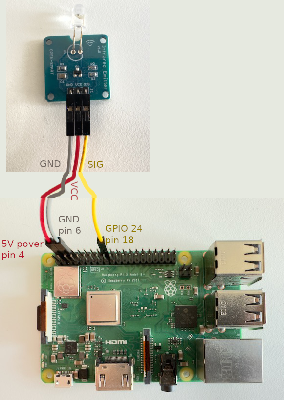

I own a Yamaha RX-461 AV receiver. It's old, but still working fine, except that
the remote control is broken. I don't want to buy a new receiver just because
the remote broke, but a working remote is the only way to access the setup menu,
which is quite unfortunate. I tried to order replacement remotes, but all of
them would only work partially. In particular, not a single one allowed me to
access the setup menu.

So I decided, I've got to build my own remote control. Conveniently, I still
have a Raspberry Pi laying around. All I needed to get was an infrared emitter
for it. I decided for the
[Open-Smart](https://de.aliexpress.com/item/1922513322.html?src=google&src=google&albch=shopping&acnt=272-267-0231&slnk=&plac=&mtctp=&albbt=Google_7_shopping&gclsrc=aw.ds&albagn=888888&ds_e_adid=&ds_e_matchtype=&ds_e_device=c&ds_e_network=x&ds_e_product_group_id=&ds_e_product_id=de1922513322&ds_e_product_merchant_id=107732261&ds_e_product_country=DE&ds_e_product_language=de&ds_e_product_channel=online&ds_e_product_store_id=&ds_url_v=2&albcp=20701456946&albag=&isSmbAutoCall=false&needSmbHouyi=false&gad_source=1&gclid=CjwKCAiA9ourBhAVEiwA3L5RFiCh_b4eiJv86rUixLbVt-wBBywLTV-rrC6MvucUWRdg6bwijeGwUBoCBSQQAvD_BwE&aff_fcid=b13aaefbd2f341c89fe4bd8bfc82d1a7-1701015594325-07802-UneMJZVf&aff_fsk=UneMJZVf&aff_platform=aaf&sk=UneMJZVf&aff_trace_key=b13aaefbd2f341c89fe4bd8bfc82d1a7-1701015594325-07802-UneMJZVf&terminal_id=467cc2b2e48246a6afb4149c425f4c5c&afSmartRedirect=y)
emitter because that one just needs to be connected to Raspberry Pi. But you can
certainly get the IR-LED, resistors, and a transistor to assemble the control
circuit yourself. This is the wiring:



## Initial configuration

We then need to setup the Raspberry Pi to be able to send IR codes via the
emitter. We will be using `lirc` for that, so go ahead and install it.

```bash
sudo apt install lirc
```

Next we add the required kernel modules to be loaded during system boot. Add the
following lines to `/etc/modules`:

```
lirc_dev
lirc_rpi gpio_out_pin=24
```

We also need to adjust the lirc configuration itself in
`/etc/lirc/lircd.conf` by editing the corresponding lines:

```
[lircd]
driver = default
device = /dev/lirc0
```

In the `/boot/config.txt`, we need this line:

```
dtoverlay=gpio-ir-tix,gpio_pin=24
```

## Configuring the remote

Now we have the basic configuration of the hardware, but we also need to
configure the specific remote control commands, we want to send. But for that we
need to know these. Usually, one would record these from an existing remote with
an IR receiver. However, this is not an option for me as the old remote does not
work anymore. Luckily, I found out (somewhere on the Internet) that Yamaha is
using the NEC protocol, and I found [this helpful
documentation](https://techdocs.altium.com/display/FPGA/NEC+Infrared+Transmission+Protocol)
how the protocol works. So all I had to do, was to translate this into a [lirc
configuration](https://www.lirc.org/html/lircd.conf.html) in
`/etc/lirc/lircd.conf.d/yamaha-rx-v461.lircd.conf`:

```
begin remote

    name RX_V461
    bits 32
    flags SPACE_ENC|CONST_LENGTH

    gap 108000
    zero 563 562
    one 563 1687
    header 9000 4500
    ptrail 563

    toggle_bit_mask 0x0

    begin codes
        # Add command codes here.
        # What are these, though? 🤔
    end codes

end remote
```

To be able to send actual commands, we need the codes for those commands,
though.  Here I got lucky again, and found a [forum with a large collections of
files](http://hifi-remote.com/forums/dload.php?action=category&cat_id=9&sort_method=file_name&sort_order=ASC&start=600&utm_source=pocket_saves)
for all sorts of hi-fi devices. Among those files is a "Yamaha Master File" which
contains a bunch of PDFs with remote control codes for different Yamaha
receivers. Lo and behold, the Yamaha RX-V461 is among them! The code for "set
menu", for example, is given as `7A-84`. Now, in the NEC protocol, each byte is
followed by the bitwise inverse (presumably to always have a constant
transmission length), so the full command code should be `7A-85-84-7B`. However,
this did not work.

The final piece to the puzzle fell into place reading some obscure forum post.
The bit-order needs to reversed! So `7A` becomes `5E`, for example, or the whole
command code would be `5E-A1-21-DE`. When putting it into the configuration it
becomes:

```
begin remote

    # The stuff from above goes here

    begin codes
        SET_MENU 0x5EA121DE
    end codes
```

The other codes follow the same principle. The full configuration can be found
[here](https://gist.github.com/jgosmann/1b3ebb38d0cf4437aec97200b5c72c83).

## Sending IR commands

Reboot the Raspberry Pi after all those configuration changes to ensure the
latest settings are loaded. You can send a single command like this:

```bash
irsend SEND_ONCE RX_V461 SET_MENU
```

If you need to check, that the IR transmitter is sending anything at all, a cell
phone camera comes in handy (use the front camera if you're using an iPhone).
The IR flashes should be visible on it.

If you want to send a command repeatedly, use `SEND_START` and `SEND_STOP`
instead of `SEND_ONCE`.

